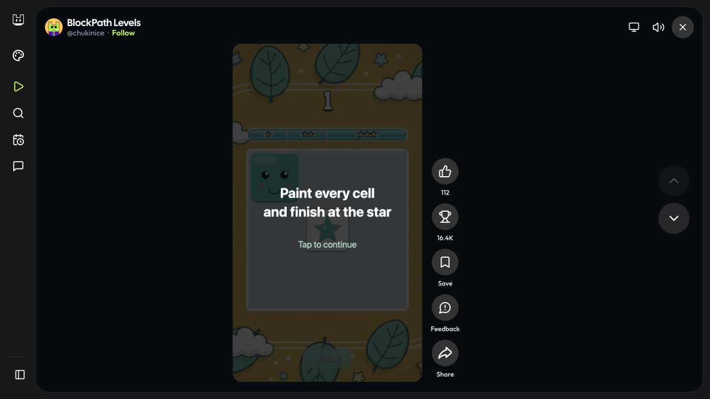
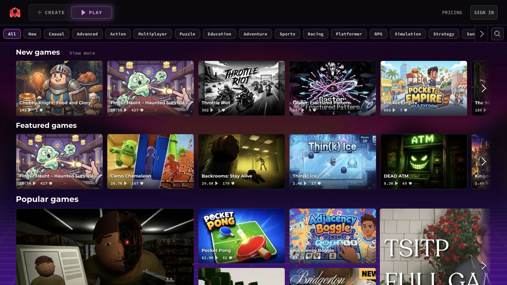
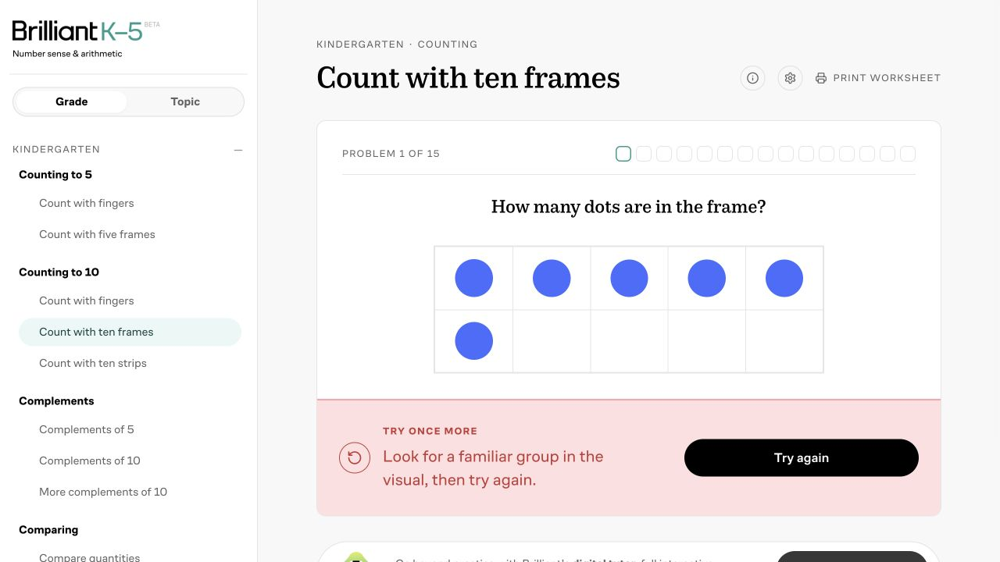
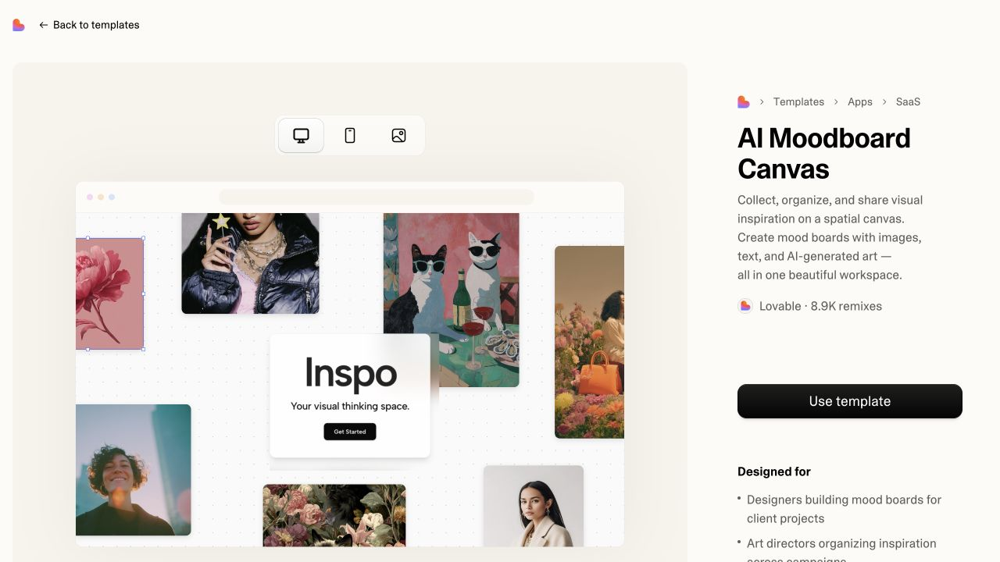
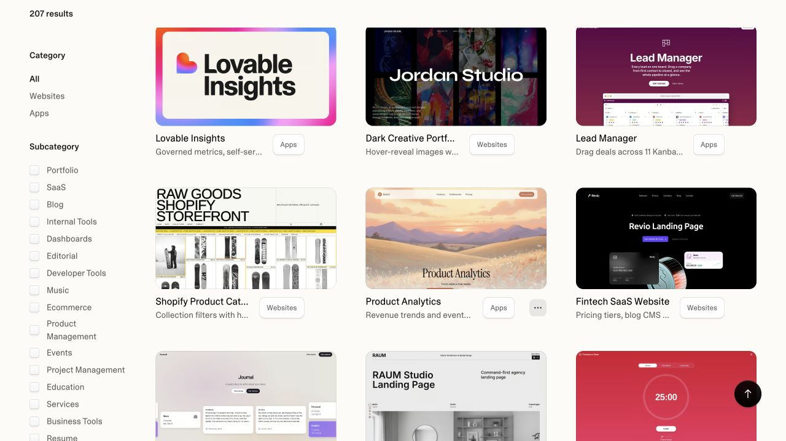
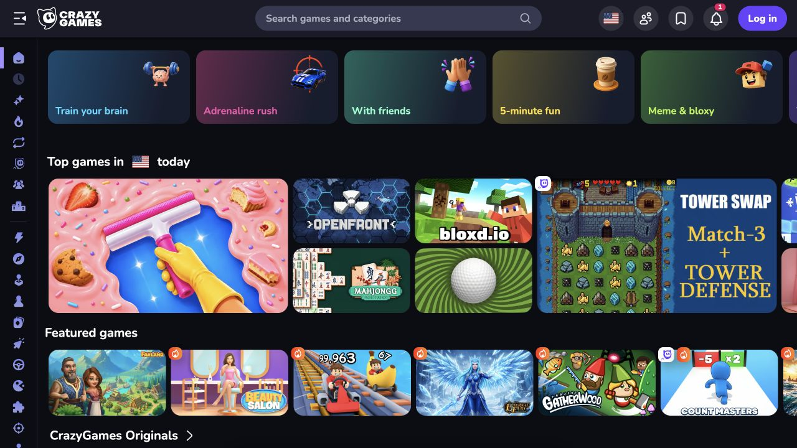
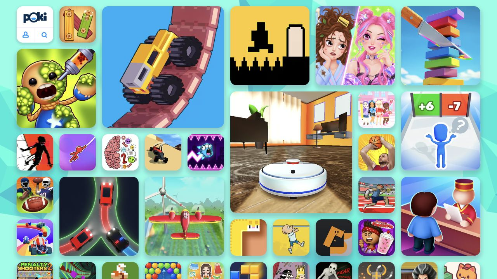
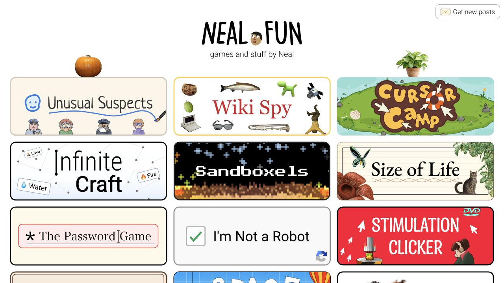
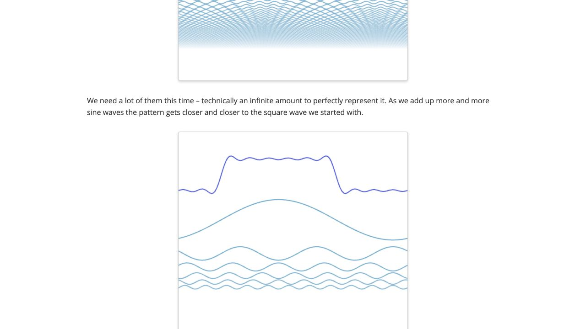

# GemiGo：相关产品的界面与使用体验研究

日期：2026-10-03（Asia/Shanghai）

状态：产品研究与候选启发，未冻结定位、改版方案或实施批次。

背景：[方向探索](2026-10-03-app-deployment-direction.thought.md)、[商业研究](2026-10-03-related-products-commercial-research.thought.md)、[现有应用组合](2026-10-03-app-portfolio-analysis.thought.md)。

## 这轮研究要回答什么

用户希望补充产品层面的研究，认为此前部分参考页面偏老；希望优先看 2026 年、尤其最近几个月的产品与界面。关注范围包括相近产品和有启发的邻近产品，不限于直接竞品。

本轮优先考察 AI 创作与消费结合的平台，同时参考互动学习、浏览器游戏与现代应用模板。围绕“用户直接来 GemiGo 玩、学习”的候选方向，观察内容发现、作品说明、第一次使用、继续使用与作者连接。

用户提出模型进步可能带来更好的新界面。这是选样动机，不是本研究已证实的因果关系。**产品近期更新、当前页面外观、界面改版时间是三个不同事实。** 以下日期只证明对应官方更新；未找到改版日期时明确标注。视觉评价是研究判断，未测量转化率或学习效果。

## 优先看哪些样本

| 产品 | 参考价值与当前视觉判断 | 最近时间证据 | 本轮实际查看深度 |
| --- | --- | --- | --- |
| [Remix](https://remix.gg/) | 最接近生产者与玩家同平台；深色、亮色强调、作品预览突出 | 官方更新至 2026-09-30，包含分类精选；09-23 推出预告片入口 | 首页 → BlockPath Levels → 游戏内首次说明；未完成关卡 |
| [Rosebud Play](https://rosebud.ai/play) | AI 创作与公开作品消费的双入口；紫色深色界面、横向内容分区 | 2026-06-17 官方发布 3D 世界转游戏教程；Play 改版日期未证实 | Play 首页、Education 分类；未登录创作或完整试玩 |
| [Brilliant](https://brilliant.org/) | 互动学习与不同用户角色入口；浅色留白、鲜明操作按钮、视觉题目 | 入门帮助更新于 2026-09-09；当前首页与练习界面上线日期未证实 | 首页 → 免费练习 → 答错 → 提示 → 重试答对 → 下一题 |
| [Lovable 模板](https://lovable.dev/templates) | 当代 AI 应用的视觉与作品展示参考；实际预览优先 | 官方 2026-09-24 发布免费聊天更新；模板改版日期未证实 | 首页、模板目录、AI Moodboard Canvas 详情及加载后的嵌入预览 |
| [CrazyGames](https://www.crazygames.com/) | 游戏发现和使用意图入口；密集但有视觉层级 | 2026-10-03 当前页面观察；未证实近期视觉改版 | 首页与导航；未验证游戏内流程 |
| [Poki](https://poki.com/zh) | 作品封面直接构成首页；适合研究低门槛发现 | 2026-10-03 当前页面观察；未证实近期视觉改版 | 中文首页目录；未完成具体游戏试玩 |
| [Neal.fun](https://neal.fun/) | 强内容概念、独特封面和作者感；简洁而有辨识度 | 2026-10-03 当前首页观察；作品发布时间未逐项核实 | 首页；Deep Sea 被安全检查拦住，未进入互动 |
| [Explorable Explanations](https://explorabl.es/) | 科学互动内容设计补充；不是本轮新界面样本 | 历史项目集合，含明确的 2018 活动内容 | 集合首页、傅里叶交互文章，操作滑杆并观察其状态变化 |

上述截图均为当日桌面浏览器 1280×720 实际页面。未检查移动端布局、跨会话进度恢复、付费体验或登录后的创作发布链路。截图是当时可见状态，不代表完整页面、所有作品质量或平台规模。

## Remix：作品消费应有完整的上下文

实际首页把 Create、Play、搜索等入口分开，主区域以游戏预览、作者、标签和试玩入口组织，而非把部署能力说明放在最前面。目录还区分设备与内容类型。

从首页进入 [BlockPath Levels](https://remix.gg/g/blockpath-levels)，未遇到登录门槛便加载游戏说明。游戏周围仍有作者、关注、收藏、分享、排行榜和下一款入口；这些控件存在，不等于本轮验证了其登录行为或数据保存。

官方 [更新记录](https://remix.gg/changelog) 的近期设计变化有明确日期：09-30 分类以团队精选开头；09-23 从游戏预告片直接进入试玩；09-18 支持桌面游戏宽画幅。07-31 宣布平台处理关卡进度等能力，属于官方能力说明，本轮未验证存档恢复。

**启发：** GemiGo 可以研究如何把“作品运行页”同时做成作者与下一份内容的入口。平台有机会帮助作者获得消费者，而不只提供一个孤立链接。共享进度能力需要作品接入，不能假定任意粘贴 HTML 都自动兼容。社交、竞赛与完整 AI 编辑器不必随这个思路一起纳入早期范围。

## Rosebud：创作入口和来玩入口都清楚，但分类不保证内容质量

Play 顶部明确区分 CREATE / PLAY，下面是题材分类，以及 New、Featured、Popular 等内容分区。卡片展示作品封面、标题及互动数量，能看出作品是平台的主体。

实际打开 [Education 分类](https://rosebud.ai/play/c/education)，里面既有知识和游戏相关内容，也有 Cozy Pomodoro 等专注计时作品。仅凭标题不能判定作品归类错误，但能观察到不同用途混列；“教育”标签不足以帮助用户判断年龄、目标和玩法。

[2026-06-17 官方教程](https://lab.rosebud.ai/blog/how-to-use-marble-worlds-in-rosebud) 展示从外部 3D 世界到 Rosebud 游戏、再发布链接的路径。这说明它仍在推进创作到消费的能力，不证明 Play 页面于六月改版。本轮没有执行生成、发布或多人玩法。

**启发：** 双入口是可以直接研究的产品结构。若 GemiGo 重点探索教育学习，作品说明应能回答“谁适合用、学什么、需要怎样操作”；精选内容的质量标准比再增加一层宽泛分类更值得验证。

## Brilliant：教育体验的关键在操作与反馈

当前首页以个人数学与编程辅导为主，提供学习者、家长或教师入口，并直接展示互动题目。这个入口设计照顾了使用者和挑选内容的人，但不意味着 GemiGo 必须增加角色选择步骤。

实际进入 [免费练习](https://brilliant.org/practice/) 的 [十格计数](https://brilliant.org/practice/kindergarten/counting/count-with-tenframes/)：不创建账户即可答题。页面一次给出一个视觉问题，有 15 题进度；对 6 个点故意选 5 后，给出提示与重试；随后选 6，显示答对，进度到 7%，继续进入第二题。

目录通过年级与主题组织；观察到部分年级或内容标为 Coming Soon，不能把 K–5 入口理解为全部已完成。主站 Koji 辅导、个性化与进度能力来自首页及[帮助说明](https://brilliant.org/help/using-brilliant/how-do-i-get-started-on-brilliant/)，未验证登录后的完整体验。

**启发：** 教育学习作品的质量不能只看动画或游戏皮肤。用户操作后能否知道发生了什么、错误是否得到有用反馈、下一步是否清楚，才是更具体的产品标准。对作者可以研究示例与质量指导；这些观察不证明实际学习效果。

## Lovable：把“这是怎样的成品”放到介绍之前

模板目录使用实际应用界面作为封面，配一句具体用途；过滤维度包括产品类型、子类别与使用人群。与只给名称和技术标签相比，用户能更早判断它是不是自己想要的东西。

实际打开 [AI Moodboard Canvas](https://lovable.dev/templates/apps/saas/inspo-canvas-visual-moodboard-creator-template)，页面左边加载成品预览，右边说明用途、作者和采用模板入口，并提供 Desktop、Mobile、Screenshots 控件。加载后的嵌入应用到达展示与 Get Started 页面；没有验证登录后画板操作、自动保存或模板复制。

官方 [09-24 更新](https://lovable.dev/blog/chat-for-free) 是聊天与构建前探索能力更新，不是模板视觉发布时间。

**启发：** 用户强调的新界面参考，可以从这里直接看当代 AI 作品，而不仅看 SaaS 官网。GemiGo 可以研究真实截图、公开预览和清楚用途的组合；不应从这一例子推导出必须内置 AI 生成器。其目录服务创作者选择模板，不是消费者选游戏，两种任务需要分别设计。

## CrazyGames 与 Poki：首页围绕消费者的下一次选择

CrazyGames 当前首页除了题材分类，还提供 Train your brain、With friends、5-minute fun 等意图入口。作品区使用不同大小封面与分区标题，帮助扫描重点。Poki 首页则让封面几乎占据全部主区域，以轻量导航和搜索配合直接发现。

**启发：** “教育、游戏、开发”等类别之外，可以研究“玩五分钟、和朋友一起、探索一个科学现象”等专题，帮助用户按当下意图选择。类别排序、专题策展与作品排序是不同问题；本轮没有提出替换现有应用排序逻辑。目录数量不多时，少量明确的精选专题比照搬大型平台密集频道更适合验证。

**取舍：** 高封面密度适合直觉选游戏，但教育内容还需要明确目标、难度和适用人群。Poki 的封面形式不宜完整照搬为教育目录。本轮没有测量两站首次可操作时间或重复访问率。

## Neal.fun 与历史科学互动：内容概念本身也是设计

Neal.fun 当前首页使用辨识度高的手绘风格与概念封面，作品各有清楚主题。它说明“让人想点进去”可以来自内容的好奇心，而不一定来自复杂 UI。Deep Sea 本轮被安全检查拦住，只记录首页观察，不声称已完成海洋互动体验。

历史补充 [交互式傅里叶介绍](https://jezzamon.com/fourier/) 把波形、拆分、滑杆、自由绘制和解释串在同一篇内容中。本轮实际操作方波示例滑杆，观察数值变化与可见波形；未测试音频播放和全文所有控件。该案例不作为 2026 新界面证据。

**启发：** 科学教育游戏还可以包括可操作的实验、模拟与探索。值得验证的是“操作一个变量 → 看到现象 → 理解解释”能否形成有趣且有用的体验，不必把科学内容都做成选择题或加积分的课程。

## 对 GemiGo 的候选判断

以下为研究建议，不是实施授权、已确认路线或商业需求证据。

1. **优先研究消费者第一次来能做什么。** 在发现与发布都能保持清楚的前提下，让用户先看到具体作品、知道用途、开始玩或学习，再理解平台。参考 Remix / Rosebud 的双入口，而不是复制其全部功能。
2. **让好作品容易被挑出来。** 当前供给可先用人工核验的截图、短说明与少量专题组织；学习目标、适用范围、操作方式和设备支持应来自作者或实际检查，不能仅由分类标签推断。
3. **作品使用页可以承接继续发现。** 作者身份、简单玩法、相关作品与下一份内容，是连接生产者和消费者的候选基础；是否需要收藏、进度或账户，应从再次使用任务中判断。
4. **同时提高作品内部体验的标准。** 重点看第一次操作、反馈、完成状态与下一步。平台视觉与内容质量都影响体验；封面漂亮不能证明教育价值。
5. **先验证来玩与再来的理由。** 结合现有作品选出一小组教育、科学探索与游戏案例，观察开始使用、完成及再次访问。PV / UV 只说明访问；不能把访问增长直接视为学习效果、留存或付费意愿。

更值得继续验证的差异化假设是：GemiGo 能否成为用户容易发现、直接使用的高质量互动学习与游戏内容入口，同时让作者获得真实使用和改进反馈。它符合本次重点探索，但尚未替代当前定位边界，也不排除其他应用类别。

## 证据与研究限制

- 浏览器观察与截图证明所见页面、入口及少量交互；官方文字证明其公开描述与更新日期，两者不互相替代。
- 近期发布日期不证明视觉由更强 AI 模型生成，也不能证明比旧产品体验更好。未核验作品逐项生成工具或设计方法。
- 未创建账户、付款、提交作品或测试作者收益；未对外发送项目材料。此轮与商业研究互补，不新增收入估算。
- 未验证移动端、跨设备存档、推荐算法、完整创作链路、学习效果、内容合规审核或消费者付费意愿。
- 后续定方案时需要结合 GemiGo 真实作品与用户行为重新选择；不以外部成熟平台的功能数量作为必须补齐的清单。
